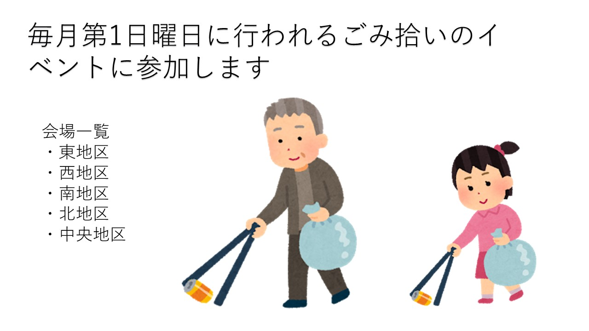
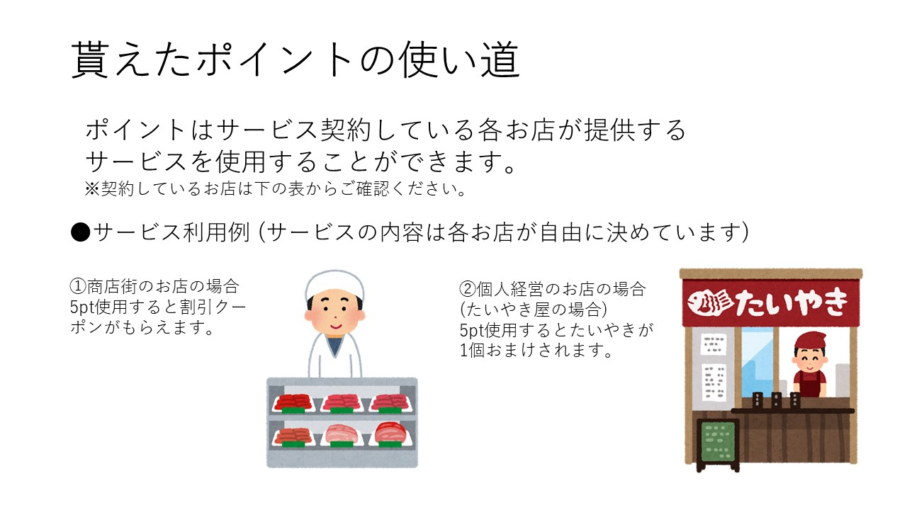

# 特典について  
## 清掃活動に参加することで・・・ 
袋のごみの量に応じて主催者側の基準によりスタンプを差し上げます。
また、参加者の年齢に応じて追加するスタンプの数が異なっており、 

| 年齢  |   追加数   |
| ---- | ---- |
|10~18歳| +2個 |
| 一般 | +1個 |
| 親子連れ | +3個 |
| 60歳以上 | +4個 |

以上のようになっており、10歳以下のお子様も参加いただけますが、家族の同伴が必要となります。  

また、毎回参加していただくごとに30ポイントを差し上げます。 
参加後に拾ってきてもらった袋を一度回収させていただき、こちらで用意した箱の大きさ(大・中・小)に合ったスタンプを付与する形となっています。 

| 大きさ  |   スタンプ   |
| ---- | ---- |
| 大 | 5個 |
| 中 | 3個 |
| 小 | 1個 |

このような配分となっております。
    

## ポイントの使い道 
集めていただいたポイントは、商店街の一部の店舗にてポイントを使うことができます。(ポイントのご利用には期限がございます。)ポイントの還元方法については、店舗によって異なり、以下の店舗にてご使用いただけます。 

[協賛店一覧](https://mizutanikosuke.github.io/kyousanten/ "協賛店一覧")

 
また、上記のマークのある店舗でご利用できます。 

